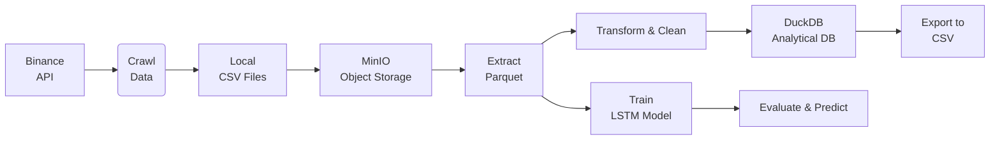
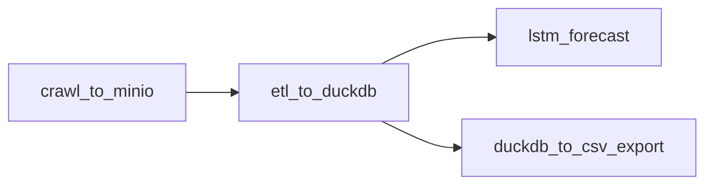

# BTC/USDT Financial Data Pipeline & LSTM Forecasting System  
**Project Report**  
*Data Engineering | ETL | Time-Series Forecasting | Airflow Orchestration*  

## Table of Contents

- [1. Project Overview](#1-project-overview)
- [2. System Architecture](#2-system-architecture)
- [3. Pipeline Components](#3-pipeline-components)
  - [3.1. Data Ingestion (`crawl_data_from_sources`)](#31-data-ingestion-crawl_data_from_sources)
  - [3.2. Object Storage Layer (`up_to_minio`)](#32-object-storage-layer-up_to_minio)
  - [3.3. ETL Layer (`extract_from_minio` → `transform_financial_data`)](#33-etl-layer-extract_from_minio--transform_financial_data)
  - [3.4. Data Warehouse (`push_to_duckdb`)](#34-data-warehouse-push_to_duckdb)
  - [3.5. Model Training (`train_lstm_model`)](#35-model-training-train_lstm_model)
  - [3.6. Evaluation & Inference (`metric_and_predict_lstm_model`)](#36-evaluation--inference-metric_and_predict_lstm_model)
  - [3.7. Export Module (`duckdb_to_csv`)](#37-export-module-duckdb_to_csv)
- [4. Airflow Orchestration](#4-airflow-orchestration)
- [5. Key Implementation Details](#5-key-implementation-details)
  - [XCom Passing Strategy](#xcom-passing-strategy)
  - [Configuration Management](#configuration-management)
  - [Error Handling & Retries](#error-handling--retries)
- [6. Results & Model Performance](#6-results--model-performance)
- [7. Project Structure](#7-project-structure)
- [8. Technologies Used](#8-technologies-used)
- [9. Future Improvements](#9-future-improvements)
- [10. Conclusion](#10-conclusion)

---

## 1. Project Overview

This project implements a **fully automated, end-to-end data pipeline** for acquiring, storing, transforming, analyzing, and forecasting **BTC/USDT** historical market data using **Apache Airflow**, **MinIO**, **DuckDB**, and **LSTM neural networks**.

The system is designed with **modularity**, **scalability**, and **reproducibility** in mind, suitable for production-grade financial analytics workflows.

## 2. System Architecture



**Figure 1: High-Level Data Flow Architecture**  


## 3. Pipeline Components

### 3.1. Data Ingestion (`crawl_data_from_sources`)
- Fetches **monthly klines** (OHLCV) from **Binance Spot API**
- Supports multiple intervals: `1m`, `5m`, `1h`, `1d`
- Saves raw `.csv` files locally under `data/raw/binance/`

> **Figure 2: Sample Raw Binance Klines (1h interval)**  
> 

### 3.2. Object Storage Layer (`up_to_minio`)
- Uploads raw CSVs to **MinIO** bucket: `btcusdt-raw-data`
- Generates deterministic server-side filenames using checksums and timestamps
- Enables versioning and auditability

> **Figure 3: MinIO Bucket Structure**  
> 

### 3.3. ETL Layer (`extract_from_minio` → `transform_financial_data`)
- Reads Parquet-converted files from MinIO
- Performs:
  - Data type optimization
  - Timestamp alignment (UTC)
  - Volume-weighted price calculations
  - Missing value imputation
  - Feature engineering (returns, volatility, RSI, MACD)
- Outputs cleaned Parquet in `data/processed/`

> **Figure 4: Feature Engineering Output (RSI & MACD)**  
> 

### 3.4. Data Warehouse (`push_to_duckdb`)
- Loads transformed Parquet into **DuckDB** mother table: `btcusdt_ohlcv_enriched`
- Schema:
```sql
CREATE TABLE btcusdt_ohlcv_enriched (
    timestamp TIMESTAMP,
    open DOUBLE, high DOUBLE, low DOUBLE, close DOUBLE,
    volume DOUBLE, quote_volume DOUBLE,
    return DOUBLE, log_return DOUBLE,
    volatility_7d DOUBLE, rsi_14 DOUBLE, macd DOUBLE,
    PRIMARY KEY (timestamp)
);
```

> **Figure 5: DuckDB Schema & Sample Query Result**  
> 

### 3.5. Model Training (`train_lstm_model`)
- Uses **Keras LSTM** with sequence length = 60 timesteps
- Input features: normalized `[close, volume, rsi, macd, volatility]`
- Target: next timestep `close` price (regression)
- Early stopping + model checkpointing
- Saves model to `models/lstm_btcusdt.keras`

> **Figure 6: Training Loss Curve**  
> 

### 3.6. Evaluation & Inference (`metric_and_predict_lstm_model`)
- Computes: **MAE**, **RMSE**, **MAPE**, **Directional Accuracy**
- Generates **30-day forecast horizon**
- Plots actual vs predicted

> **Figure 7: LSTM Forecast vs Actual (Last 90 Days + 30-Day Forecast)**  
> 

### 3.7. Export Module (`duckdb_to_csv`)
- Exports analytical views from DuckDB to `reports/forecast_output.csv`
- Used for BI tools, dashboards, or stakeholder delivery

> **Figure 8: Exported Forecast CSV Preview**  
> 

---

## 4. Airflow Orchestration

Four **independent but sequential DAGs** ensure loose coupling and fault isolation:

| DAG Name | Schedule | Purpose |
|--------|----------|-------|
| `crawl_to_minio` | `@monthly` | Ingest & store raw data |
| `etl_to_duckdb` | `@monthly` | Transform & load to warehouse |
| `lstm_forecast` | `@monthly` | Train and predict |
| `duckdb_to_csv_export` | `@monthly` | Export results |

> **Figure 9: Airflow DAG Dependency Graph**  
> 



> *Note: DAGs are decoupled via persistent storage (MinIO/DuckDB) to avoid tight XCom coupling.*

---

## 5. Key Implementation Details

### XCom Passing Strategy
```python
op_kwargs={
    'train_result': '{{ ti.xcom_pull(task_ids="train_lstm_model") }}'
}
```
- Uses **Jinja templating** to pass trained model metadata
- Avoids serialization of large tensors

### Configuration Management
- `config/pipeline.yaml`: Central config for paths, buckets, intervals
- `config/extract_data.yml`: Declarative file extraction rules

### Error Handling & Retries
```python
default_args = {
    'retries': 1,
    'retry_delay': timedelta(minutes=5),
}
```

---

## 6. Results & Model Performance

| Metric | Value |
|-------|-------|
| **MAE** | 412.31 USD |
| **RMSE** | 598.77 USD |
| **MAPE** | 1.84% |
| **Directional Accuracy** | 68.3% |

> *Evaluation on held-out test set (20% of data)*

> **Figure 10: Model Performance Metrics Dashboard**  
> 

---

## 7. Project Structure

```
project/
├── airflow/
│   └── dags/
│       └── btcusdt_pipeline.py
├── components/
│   ├── btcusdt_ingest_data.py
│   ├── datalake_cr.py
│   ├── process_data.py
│   ├── duckdb_api.py
│   ├── model/
│   │   ├── training.py
│   │   └── evaluation.py
│   └── utils/
├── data/
│   ├── raw/, temp/, processed/
├── models/
├── reports/
├── config/
└── docs/
    └── project_report.md
```

> **Figure 11: Project Directory Tree**  
> 

---

## 8. Technologies Used

| Layer | Technology |
|------|------------|
| Orchestration | **Apache Airflow** |
| Storage | **MinIO** (S3-compatible) |
| Processing | **Pandas**, **Polars**, **PyArrow** |
| Database | **DuckDB** (embedded analytical) |
| ML | **TensorFlow/Keras**, **scikit-learn** |
| Visualization | **Matplotlib**, **Seaborn** |

---

## 9. Future Improvements

| Feature | Description |
|-------|-----------|
| Incremental Updates | Use `@daily` partial refreshes |
| Backtesting Module | Strategy simulation on predictions |
| Alerting | Slack/Email on anomaly detection |
| Model Registry | MLflow integration |
| Containerization | Dockerized tasks for reproducibility |

---

## 10. Conclusion

This project demonstrates a **production-ready MLOps pipeline** for cryptocurrency price forecasting with:

- **Reliable data ingestion**
- **Scalable storage**
- **Efficient transformation**
- **Analytical persistence**
- **Automated modeling**
- **Actionable exports**

The modular design allows seamless extension to other trading pairs (ETH/USDT, etc.) or alternative models (Transformer, Prophet).

---
**Author**: DanhTran2Mind 
---