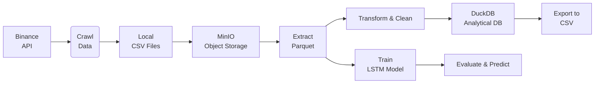
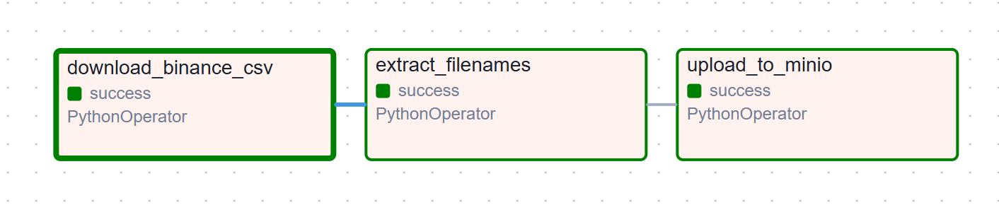
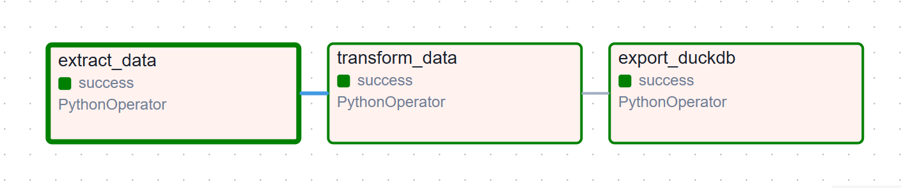
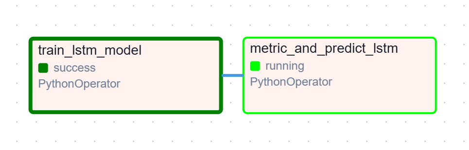
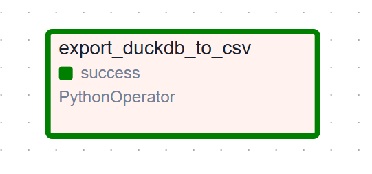
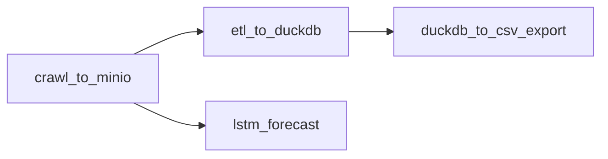

# BTC/USDT Financial Data Pipeline & LSTM Forecasting System  
**Project Report**  
*Data Engineering | ETL | Time-Series Forecasting | Airflow Orchestration*  

## Table of Contents

- [1. Project Overview](#1-project-overview)
- [2. System Architecture](#2-system-architecture)
- [3. Pipeline Components](#3-pipeline-components)
  - [3.1. Data Ingestion (`crawl_data_from_sources`)](#31-data-ingestion-crawl_data_from_sources)
  - [3.2. Object Storage Layer (`up_to_minio`)](#32-object-storage-layer-up_to_minio)
  - [3.3. ETL Layer (`extract_from_minio` → `transform_financial_data`)](#33-etl-layer-extract_from_minio--transform_financial_data)
  - [3.4. Data Warehouse (`push_to_duckdb`)](#34-data-warehouse-push_to_duckdb)
  - [3.5. Model Training (`train_lstm_model`)](#35-model-training-train_lstm_model)
  - [3.6. Evaluation & Inference (`metric_and_predict_lstm_model`)](#36-evaluation--inference-metric_and_predict_lstm_model)
  - [3.7. Export Module (`duckdb_to_csv`)](#37-export-module-duckdb_to_csv)
- [4. Airflow Orchestration](#4-airflow-orchestration)
- [5. Key Implementation Details](#5-key-implementation-details)
  - [XCom Passing Strategy](#xcom-passing-strategy)
  - [Configuration Management](#configuration-management)
  - [Error Handling & Retries](#error-handling--retries)
- [6. Project Structure](#7-project-structure)
- [7. Technologies Used](#8-technologies-used)
- [8. Future Improvements](#9-future-improvements)
- [9. Conclusion](#10-conclusion)

---

## 1. Project Overview

This project implements a **fully automated, end-to-end data pipeline** for acquiring, storing, transforming, analyzing, and forecasting **BTC/USDT** historical market data using **Apache Airflow**, **MinIO**, **DuckDB**, and **LSTM neural networks**.

The system is designed with **modularity**, **scalability**, and **reproducibility** in mind, suitable for production-grade financial analytics workflows.

## 2. System Architecture
This is the scalable pipeline fetches Binance crypto data, stores in MinIO, processes with DuckDB and LSTM for analysis and prediction.


## 3. Pipeline Components

### 3.1. Data Ingestion (`crawl_data_from_sources`)
- Fetches **monthly klines** (OHLCV) from **Binance Spot API**
- Supports multiple intervals: `1m`, `5m`, `1h`, `1d`
- Saves raw `.csv` files locally under `data/raw/binance/`

> **Figure 2: Sample Raw Binance Klines (1h interval)**  
The Features and Example Data of `BTCUSDT-1s-2025-08` like:

| Open time                  | Open       | High       | Low        | Close      | Volume   | Close time             | Quote asset volume | Number of trades | Taker buy base asset volume | Taker buy quote asset volume | Ignore |
|----------------------------|------------|------------|------------|------------|----------|------------------------|--------------------|------------------|-----------------------------|-------------------------------|--------|
| 1754006401000000           | 115758.12  | 115758.12  | 115742.54  | 115742.54  | 0.74915  | 1754006401999999       | 86719.128048       | 124              | 0.16180                     | 18729.640409                  | 0      |
| 1754006402000000           | 115742.53  | 115742.53  | 115720.00  | 115720.00  | 0.18958  | 1754006402999999       | 21940.492584       | 156              | 0.00184                     | 212.929830                    | 0      |
| 1754006403000000           | 115720.00  | 115724.23  | 115720.00  | 115724.23  | 0.34030  | 1754006403999999       | 39379.862285       | 50               | 0.32508                     | 37618.539657                  | 0      |
| 1754006404000000           | 115724.23  | 115730.53  | 115724.22  | 115730.53  | 0.10858  | 1754006404999999       | 12565.453009       | 41               | 0.10841                     | 12545.779891                  | 0      |
| 1754006405000000           | 115730.53  | 115730.53  | 115730.52  | 115730.53  | 0.01078  | 1754006405999999       | 1247.575098        | 9                | 0.00923                     | 1068.192792                   | 0      |

### 3.2. Object Storage Layer (`up_to_minio`)
- Uploads raw CSVs to **MinIO** bucket: `btcusdt-raw-data`
- Generates deterministic server-side filenames using checksums and timestamps
- Enables versioning and auditability

### 3.3. ETL Layer (`extract_from_minio` → `transform_financial_data`)
- Reads Parquet-converted files from MinIO
- Performs:
  - Data type optimization
  - Timestamp alignment (UTC)
  - Volume-weighted price calculations
  - Missing value imputation
  - Feature engineering (returns, volatility, RSI, MACD)
- Outputs cleaned Parquet in `data/processed/`

### 3.4. Data Warehouse (`push_to_duckdb`)
- Loads transformed Parquet into **DuckDB** mother table: `btcusdt_ohlcv_enriched`
- Schema:
```sql
CREATE TABLE btcusdt_ohlcv_enriched (
    timestamp TIMESTAMP,
    open DOUBLE, high DOUBLE, low DOUBLE, close DOUBLE,
    volume DOUBLE, quote_volume DOUBLE,
    return DOUBLE, log_return DOUBLE,
    volatility_7d DOUBLE, rsi_14 DOUBLE, macd DOUBLE,
    PRIMARY KEY (timestamp)
);
```


## Table: `aggregated_financial_data`

### Columns
This is DuckDB Table Preview:

| Column | Type | Nullable | Default |
|--------|------|----------|---------|
| `Open time` | `BIGINT` | YES | — |
| `Open` | `DOUBLE` | YES | — |
| `High` | `DOUBLE` | YES | — |
| `Low` | `DOUBLE` | YES | — |
| `Close` | `DOUBLE` | YES | — |
| `Number of trades` | `BIGINT` | YES | — |


### 3.5. Model Training and Evaluation (`train_lstm_model` and `metric_and_predict_lstm`)
Model Training Configuration Overview (`configs/model_config.yml`). The training pipeline is powered by a Keras LSTM architecture designed for time-series forecasting of BTC/USDT price movements:
- Uses **Keras LSTM** with sequence length = 60 timesteps
- Input features: normalized `[close, volume, rsi, macd, volatility]`
- Target: next timestep `close` price (regression)
- Early stopping + model checkpointing
- Saves model to `ckpts/lstm_btcusdt.h5`

This is the example of Evaluation:

m
| model_path                          | dataset_merge                          | Split | Metric | Value                |
|-------------------------------------|----------------------------------------|-------|--------|----------------------|
| model_2025-10-28-11-33-51-(+07).h5 | BTCUSDT-1s-2025-08 + BTCUSDT-1s-2025-09 | Train | RMSE   | 3851.842286490972   |
| model_2025-10-28-11-33-51-(+07).h5 | BTCUSDT-1s-2025-08 + BTCUSDT-1s-2025-09 | Train | MAE    | 3110.435302734375   |
| model_2025-10-28-11-33-51-(+07).h5 | BTCUSDT-1s-2025-08 + BTCUSDT-1s-2025-09 | Train | MAPE   | 0.027629373595118523 |
| model_2025-10-28-11-33-51-(+07).h5 | BTCUSDT-1s-2025-08 + BTCUSDT-1s-2025-09 | Val   | RMSE   | 2661.8692680144904  |
| model_2025-10-28-11-33-51-(+07).h5 | BTCUSDT-1s-2025-08 + BTCUSDT-1s-2025-09 | Val   | MAE    | 2185.974853515625   |
| model_2025-10-28-11-33-51-(+07).h5 | BTCUSDT-1s-2025-08 + BTCUSDT-1s-2025-09 | Val   | MAPE   | 0.01931408792734146 |
| model_2025-10-28-11-33-51-(+07).h5 | BTCUSDT-1s-2025-08 + BTCUSDT-1s-2025-09 | Test  | RMSE   | 5700.902910943143   |
| model_2025-10-28-11-33-51-(+07).h5 | BTCUSDT-1s-2025-08 + BTCUSDT-1s-2025-09 | Test  | MAE    | 5390.45166015625    |
| model_2025-10-28-11-33-51-(+07).h5 | BTCUSDT-1s-2025-08 + BTCUSDT-1s-2025-09 | Test  | MAPE   | 0.04883997514843941 |

---

## 4. Airflow Orchestration

Four **independent but sequential DAGs** ensure loose coupling and fault isolation:

| DAG Name | Schedule | Purpose |
|--------|----------|-------|
| `crawl_to_minio` | `@monthly` | Ingest & store raw data |
| `etl_to_duckdb` | `@monthly` | Transform & load to warehouse |
| `lstm_forecast` | `@monthly` | Train and predict |
| `duckdb_to_csv_export` | `@monthly` | Export results |


These are detail DAGs:
<table>
  <tbody>
    <tr>
      <td style="text-align: center; vertical-align: middle;">
        
        <br><strong>a. <code>crawl_to_minio</code> DAG</strong>
      </td>
      <td style="text-align: center; vertical-align: middle;">
        
        <br><strong>b. <code>etl_to_duckdb</code> DAG</strong>
      </td>
    </tr>
    <tr>
      <td style="text-align: center; vertical-align: middle;">
        
        <br><strong>c. <code>lstm_forecast</code> DAG</strong>
      </td>
      <td style="text-align: center; vertical-align: middle;">
        
        <br><strong>d. <code>duckdb_to_csv_export</code> DAG</strong>
      </td>
    </tr>
    </tbody>
</table>
<div style="text-align: center;">
    <em>Figure 1: High-Level Data Flow Architecture</em>
</div>



> *Note: DAGs are decoupled via persistent storage (MinIO/DuckDB) to avoid tight XCom coupling.*

## 5. Key Implementation Details

### XCom Passing Strategy
```python
op_kwargs={
    'train_result': '{{ ti.xcom_pull(task_ids="train_lstm_model") }}'
}
```
- Uses **Jinja templating** to pass trained model metadata
- Avoids serialization of large tensors

### Configuration Management
- `config/pipeline.yaml`: Central config for paths, buckets, intervals
- `config/extract_data.yml`: Declarative file extraction rules

### Error Handling & Retries
```python
default_args = {
    'retries': 1,
    'retry_delay': timedelta(minutes=5),
}
```


## 6. Project Structure
This is the simple Project Structure graph
```
project/
├── airflow/
│   └── dags/
│       └── btcusdt_pipeline.py
├── components/
│   ├── btcusdt_ingest_data.py
│   ├── datalake_cr.py
│   ├── process_data.py
│   ├── duckdb_api.py
│   ├── model/
│   │   ├── training.py
│   │   └── evaluation.py
│   └── utils/
├── data/
│   ├── raw/, temp/, processed/
├── models/
├── reports/
├── config/
└── docs/
    └── project_report.md
```

## 7. Technologies Used

| Layer | Technology |
|------|------------|
| Orchestration | **Apache Airflow** |
| Storage | **MinIO** (S3-compatible) |
| Processing | **Pandas**, **PySpark** |
| Database | **DuckDB** (embedded analytical) |
| ML | **LSTM / BiLSTM / GRU /custom** architectures|
| Visualization | **LockerStudio** |


## 8. Future Improvements

| Feature | Description |
|-------|-----------|
| Incremental Updates | Use `@monthly` partial refreshes |
| Backtesting Module | Strategy simulation on predictions |
| Alerting | Slack/Email on anomaly detection |
| Model Registry | MLflow integration |
| Containerization | Dockerized tasks for reproducibility |

---

## 9. Conclusion

This project demonstrates a **production-ready MLOps pipeline** for cryptocurrency price forecasting with:

- **Reliable data ingestion**
- **Scalable storage**
- **Efficient transformation**
- **Analytical persistence**
- **Automated modeling**
- **Actionable exports**

The modular design allows seamless extension to other trading pairs (ETH/USDT, etc.) or alternative models (Transformer, Prophet).

---
**Author**: DanhTran2Mind 
---